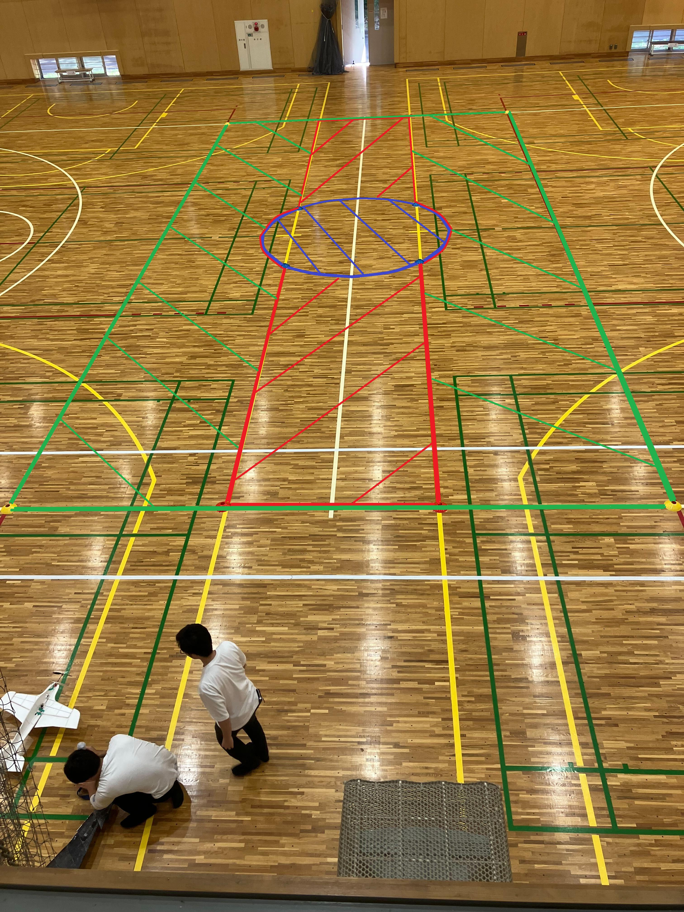
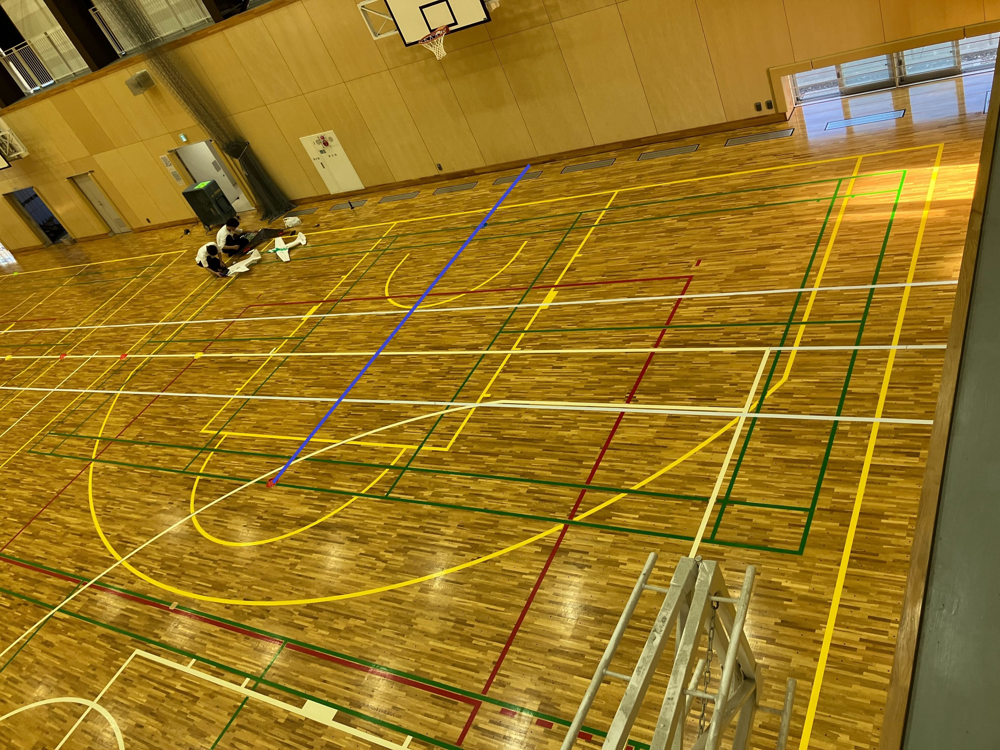
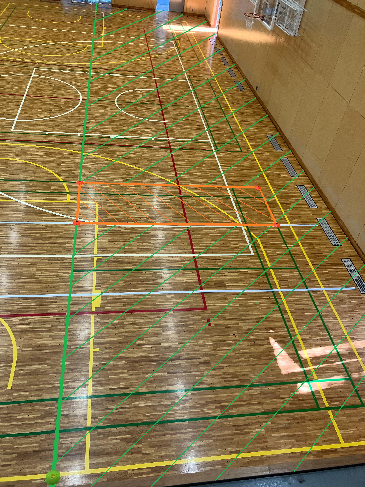

# ミニ飛行ロボコン2023　ルールブック
- 会場：東京農工大学　体育館
- 開催日：9月3日

## 目次
- [はじめに](#はじめに)
- [競技時間](#競技時間)
- [メインミッション](#メインミッション)
- [サブミッション](#サブミッション)
- [順位決定](#順位決定)
- [機体](#機体)
- [図](#図)

## はじめに
本ルールブックは第18, 19回飛行ロボコンをルールブックを参考にして作成した．本ルールブックで未定義の用語などは第19回飛行ロボコンをルールブックにおける定義に従うこと．

## 競技時間
- `標準飛行時間`を3分とする
- `最大飛行時間`を4分とする
- `飛行時間`を競技開始から終了までの時間とする
- `時間点`=(`標準飛行時間`-`飛行時間`)*5

## メインミッション
### 成功条件
- 物資投下エリアに救援物資運搬を1つ投下すること
- 離着陸エリアに静止すること
### 終了条件
- 「投下完了」をコールすること
- 次のミッションをコールすること
### 得点
- `メインミッション点` = `時間点`+`投下点`
- `時間点` = 20×(60-`計測時間`)
- `投下点` = `エリア１投下点` * 個数 + `エリア２投下点` * 個数 + `エリア3投下点` * 個数
- `エリア１投下点` = 50
- `エリア２投下点` = 150
- `エリア３投下点` = 300
- `投下点`は「投下完了」をコールした後に，初めて離着陸エリアに着陸静止したときの救援物資の位置で確定する
- `計測時間`は競技開始からメインミッションの終了条件を満たすまでの時間である
### 付記
- エリアの詳細については末尾に示す図を[参照](#メインミッション得点エリア)すること
- `投下点`はエリア1およびエリア2，エリア3に投下された救援物資のうち合計得点が高くなる最大４つを選択して計算する

## サブミッション
自動操縦，手動操縦共通のサブミッションの一覧は以下の通り．
- [8の字飛行](#8の字飛行)
- [宙返り](#宙返り)
- [無動力滑空](#無動力滑空)
- [救援物資回収](#救援物資回収)
- [帰還](#帰還)

手動操縦専用および自動操縦専用ミッションは以下の通り．
- 手動操縦専用ミッション
  - [ポール旋回](#ポール旋回)
- ハンズオフ飛行専用ミッション
  - [水平旋回](#水平旋回)

### ８の字飛行
#### 成功条件
- 8の字飛行を行うこと（飛行軌跡が「8の字」と認められること）
- 高度変化が十分小さいこと
#### 終了条件
- 次のミッションがコールされること
- 成功条件を満たすこと
#### 点数
- `8の字飛行点` = 200

### 宙返り
#### 成功条件
- 軌道面が地面に対して十分に垂直な宙返りをおこなうこと
#### 終了条件
- 次のミッションがコールされること
- `宙返り回数`が3回に達すること
#### 点数
- `宙返り点` = `宙返り回数` * 150
- 上下方向に機体が1回転して宙返り開始地点に戻ってきたら1回転成功とし，`宙返り回数`を加算する
#### 付記
- 連続しての宙返りは認めない

### 無動力滑空
#### 成功条件
- 7秒以上の滑空飛行を行うこと
#### 終了条件
- 次のミッションがコールされること
- 「パワーオン」がコールされること
- 機体が接地すること
#### 点数
- `無動力滑空点` = 300 + 50*(`滑空時間`-10)
- `滑空時間`は「パワーオフ」のコールから「パワーオン」のコールまでの時間とする
- `滑空時間`の上限は20秒とする

#### 付記
- 「パワーオン」のコール後に動力飛行をすること

### 救援物資回収
#### 成功条件
- 他のミッションで物資投下エリアに投下した救援物資のうち1つを、機体に手を
触れない状態で回収し、離着陸エリアに着陸静止すること
  - 機体が着陸静止した際に救援物資が離着陸エリア内にあれば、着陸の衝撃等で外れても成功とみなす。
#### 終了条件
- 次のミッションがコールされること
- 物資投下エリアの救援物資がなくなること
#### 得点
- `物資回収点` = `回収点`+`着陸点`
- `回収点`と`着陸点`はともに500点とする．
#### 付記
地上走行中に得点エリア外に接地した場合は離着陸エリアからやり直しとする．救援物資を回収した状態であれば，その救援物資は使用不可とする．

### ポール旋回
#### 成功条件
- `ポール旋回回数`が１以上になること
#### 終了条件
- 次のミッションがコールされること
#### 点数
- `ポール旋回点` = `ポール旋回回数` * 150 + `連続旋回回数` * 100
#### 付記
- ラインA→ラインB→ラインAの順で通過することで`ポール旋回回数`が加算される
- 旋回は途中から開始しても構わない
- ラインAは離着陸エリアとミッションエリアの境界線とする
- ラインBは体育館壁面の垂線でポールとを結ぶ線とする
  - 図を[参照](#ラインB)すること
- ポールは機体が離着陸エリアで静止しているときに取り外し，取り付けをピットメンバーがしてもよい

### 水平旋回
#### 成功条件
- 自動操縦による水平旋回を行うこと
- 水平旋回中の高度変化が十分小さいこと
#### 終了条件
- 次のミッションがコールされること
- 水平旋回回数が2回に達すること
#### 点数
- `水平旋回点` = `水平旋回回数` * 200 + `水平旋回追加点`
- 水平旋回追加点は連続して2回旋回した場合に加算される

### 帰還
#### 成功条件
- ミッションエリアから離着陸エリア内で接地して機体が完全に静止すること

#### 終了条件
- 機体が静止すること
#### 点数
- `帰還点` = `着陸点(50点)`+`停止点(100点)`+`滑走路内着陸点(100点)`
- 離着陸エリア内に接地した場合，`着陸点`として50点を加算する
- 離着陸エリア内で静止した場合，`停止点`として100点を加算する
- 滑走路内で着陸静止した場合，`滑走路内着陸点`として100点を加算する．
#### 付記
- 帰還が終了したとき競技を終了とする．

## 順位決定
### 得点計算
- すべてのミッションの得点と時間点の合計をそのチームの得点とする
- ハンズオフ飛行で成功したサブミッションの得点は1.5倍する
  - `水平旋回点`を除く
- 機体質量が基準を超える場合は`質量ペナルティ点`を加える
- 
### 区分け
下記の通り区分けを行う．
1. メインミッションに成功，ハンズオフ飛行で複数のミッションに成功，帰還に成功
2. メインミッションに成功，帰還に成功
3. メインミッションに失敗，帰還に成功
4. メインミッションに成功，帰還に失敗
5. メインミッションに失敗，帰還に失敗
### 順位決定
以下のように順位を決定する．
1. 区分けが上位のチームを上位とする
2. 同じ区分内で，得点の高いチームを上位とする
3. 1及び2で決まらない場合は審査員判定とする．

- 上位の区分けのチームを上位とする
- 同一区分内では得点の高いチームを上位とする
## 機体
- [参加可能な機体](#参加可能な機体)
- [質量](#質量)
- [空虚質量](#空虚質量)
- [独立した制御ユニット](#独立した制御ユニット)
- [電源](#電源)
- [操縦装置](#操縦装置)
### 参加可能な機体
  - 飛行機タイプ
    - 固定翼機、羽ばたき機、あるいはオートジャイロのように揚力を発生させるためのプロペラを動力駆動しない回転翼機
  - ハイブリッド機
    - 揚力を固定翼・動力駆動するプロペラその他の装置の組み合わせによって得ており、かつ推進用のプロペラ等を備える機体
  - ヘリウムガス，その他空気以外の機体の使用を認めない
### 質量
  - 空虚質量が250g以下であること
  - 「独立した制御ユニット」を搭載した機体は空虚質量が220g以下であること
  - `質量ペナルティ点` = `超過質量` * 10
    - `超過質量`は機体質量(g)から規定質量(g)を引いた値とする．ただし，小数点以下は切り上げとする．
### 空虚質量
- 機体の総質量のこと
- 救援物資とともに投下されるすべての投下補助器具の質量を含む
- 「独立してた制御ユニット」の質量は含まない
### 独立した制御ユニット
- 機体装備品のうち、単独モジュールとして機体から取り外すことができる装備は、下記
の条件を満たすことで「独立した制御ユニット」として扱われる。
  - 独立した制御ユニットを内包できる直方体の3辺の合計が25cm以下である
  - バッテリーおよび電動モーターを含まない
  ただしセンサーの稼働等、飛行に直接影響のない電動モーターは審査の上認め
  られる
  - 独立した制御ユニットを取り外した場合であっても、機体構造が大きく変化せず、機体側に操縦用受信機が搭載されている
### 電源
- セル数が2以下のLi-Poバッテリーを使用すること
- その他の電源についてはチームからの申告に基づき審査の上認めることがある
### 操縦装置
- 技適のある無線機を使用すること
- 送信機-受信機間の通信が切断されたとき，すべての動力用モーターが停止する機能を有すること

## 審査
### 機体審査
### 飛行動画審査

## 図
### メインミッション得点エリア

- エリア1は緑の斜線部とする
- エリア2は赤の斜線部とする
- エリア3は青の斜線部とする

### ラインB

写真中の青線をラインBとする

### 離着陸エリア

- オレンジの斜線部を滑走路とする．
- 緑の斜線部と滑走路を合わせて離着陸エリアとする．
- 体育館の壁面は離着陸エリア外とする
