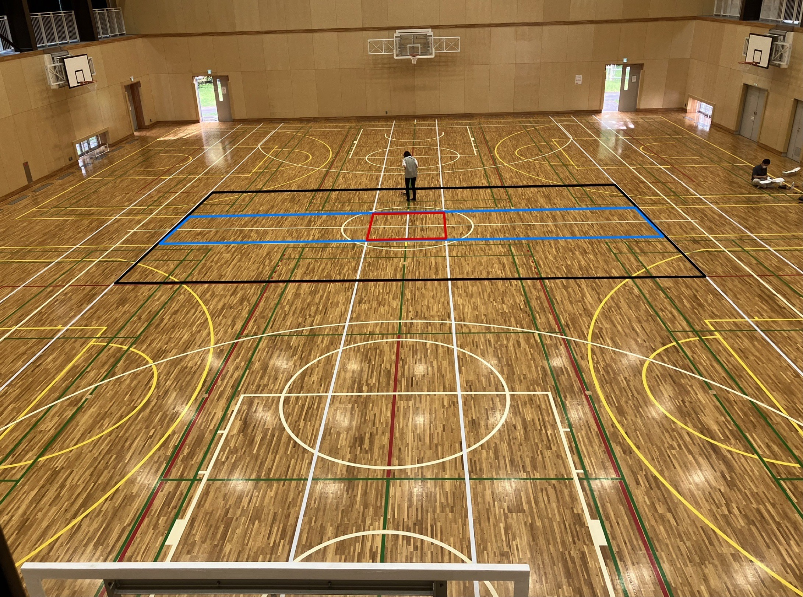

# ミニ飛行ロボコン2023　ルールブック
- 会場：東京農工大学　体育館
- 開催日（検討中）：8月末から9月頭

## 目次
- [はじめに](#はじめに)
- [メインミッション](#メインミッション)
- [サブミッション](#サブミッション)
- [機体](#機体)
- [図](#図)

## はじめに
本ルールブックは第18, 19回飛行ロボコンをルールブックを参考にして作成した．本ルールブックで未定義の用語などは第19回飛行ロボコンをルールブックにおける定義に従うこと．

## メインミッション
### 成功条件
- 物資投下エリアに救援物資運搬を1つ投下すること
- 離着陸エリアに静止すること
### 終了条件
- 「投下完了」をコールすること
- 次のミッションをコールすること
### 得点
- `メインミッション点` = `時間点`+`投下点`
- `時間点` = 20×(60-`計測時間`)
- `投下点` = `エリア１得点` * 個数 + `得点エリア２追加点` * 個数 + `得点エリア3追加点` * 個数
- `エリア１得点` = 150
- `得点エリア２追加点` = 100
- `得点エリア３追加点` = 150
- `投下点`は「投下完了」をコールした後に，初めて離着陸エリアに着陸静止したときの救援物資の位置で確定する
- `計測時間`は競技開始からメインミッションの終了条件を満たすまでの時間である
### 付記
- エリアの詳細については末尾に示す図を参照すること

## サブミッション
自動操縦，手動操縦共通のサブミッションの一覧は以下の通り．
- [8の字飛行](#8の字飛行)
- [宙返り](#宙返り)
- [無動力滑空](#無動力滑空)
- [帰還](#帰還)

手動操縦専用および自動操縦専用ミッションは以下の通り．
- 手動操縦専用ミッション
  - [ポール旋回](#ポール旋回)
- 自動操縦専用ミッション
  - [水平旋回](#水平旋回)

### ８の字飛行
#### 成功条件
- 8の字飛行を行うこと（飛行軌跡が「8の字」と認められること）
- 高度変化が十分小さいこと
#### 終了条件
- 次のミッションがコールされること
- 成功条件を満たすこと
#### 点数
- `8の字飛行点` = 200

### 宙返り
#### 成功条件
- 軌道面が地面に対して十分に垂直な宙返りをおこなうこと
#### 終了条件
- 次のミッションがコールされること
- `宙返り回数`が3回に達すること
#### 点数
- `宙返り点` = `宙返り回数` * 100
- 上下方向に機体が1回転して宙返り開始地点に戻ってきたら1回転成功とし，`宙返り回数`を加算する
#### 付記
- 連続しての宙返りは認めない

### 無動力滑空
#### 成功条件
- 10秒以上の滑空飛行を行うこと
#### 終了条件
- 次のミッションがコールされること
- 「パワーオン」がコールされること
- 機体が接地すること
#### 点数
- `無動力滑空点` = 300 + 50*(`滑空時間`-10)
- `滑空時間`は「パワーオフ」のコールから「パワーオン」のコールまでの時間とする
- `滑空時間`の上限は20秒とする

### 救援物資回収
#### 成功条件
- 他のミッションで物資投下エリアに投下した救援物資のうち1つを、機体に手を
触れない状態で回収し、離着陸エリアに着陸静止すること。機体が着陸静止
した際に救援物資が離着陸エリア内にあれば、着陸の衝撃等で外れてしまっ
ても成功とみなす。
#### 終了条件
- 次のミッションがコールされること
- 物資投下エリアの救援物資がなくなること
#### 得点
`物資回収点` = 1000
#### 付記
地上走行中に得点エリア外に接地した場合は離着陸エリアからやり直しとする．救援物資を回収した状態であれば，その救援物資は使用不可とする．

### ポール旋回
#### 成功条件
- 離着陸エリア側からラインA→ラインB→ラインA→ラインB→ラインA→ラインB→ラインAの順で通過すること
#### 終了条件
- 次のミッションがコールされること
#### 点数
- `ポール旋回点` = `ポール旋回回数` * 150 + `連続旋回回数` * 100

### 水平旋回
#### 成功条件
- 自動操縦による水平旋回を行うこと
- 水平旋回中の高度変化が十分小さいこと
#### 終了条件
- 次のミッションがコールされること
- 水平旋回回数が2回に達すること
#### 点数
- `水平旋回点` = `水平旋回回数` * 200 + `水平旋回追加点`
- 水平旋回追加点は連続して2回旋回した場合に加算される

### 帰還
#### 成功条件
- ミッションエリアから離着陸エリアに接地して機体が完全に静止すること
#### 終了条件
- 離着陸エリア外に接地するもしくは体育館の壁，設置物などに接触すること
- 成功条件を満たすこと
#### 点数
- `帰還点` = `着陸点(50点)`+`停止点(100点)`+`滑走路内着陸点(100点)`
- 離着陸エリア内に接地して静止した場合，`着陸点`として50点を加算する
- 体育館の壁に接触せずに静止した場合，`停止点`として100点を加算する
- 滑走路内で着陸静止した場合，`滑走路内着陸点`として100点を加算する．
#### 付記
- 帰還が終了したとき競技を終了とする．
## 得点計算
すべてのミッションの得点の合計をそのチームの得点とする．
## 順位決定
下記の通り区分けを行う．
1. メインミッションに成功，自動操縦ミッションに成功，帰還に成功
2. メインミッションに成功，帰還に成功
3. メインミッションに失敗，帰還に成功
4. メインミッションに成功，帰還に失敗
5. メインミッションに失敗，帰還に失敗

- 上位の区分けのチームを上位とする
- 同一区分内では得点の高いチームを上位とする
## 機体
- [参加可能な機体](#参加可能な機体)
- [質量](#質量)
- [空虚質量](#空虚質量)
- [独立した制御ユニット](#独立した制御ユニット)
- [電源](#電源)
- [操縦装置](#操縦装置)
### 参加可能な機体
  - 飛行機タイプ
    - 固定翼機、羽ばたき機、あるいはオートジャイロのように揚力を発生させるためのプロペラを動力駆動しない回転翼機
  - ハイブリッド機
    - 揚力を固定翼・動力駆動するプロペラその他の装置の組み合わせによって得ており、かつ推進用のプロペラ等を備える機体
  - ヘリウムガス，その他空気以外の機体の使用を認めない
### 質量
  - 空虚質量が250g以下であること
  - 「独立した制御ユニット」を搭載した機体は空虚質量が220g以下であること
### 空虚質量
- 機体の総質量のこと
- 救援物資とともに投下されるすべての投下補助器具の質量を含む
- 「独立してた制御ユニット」の質量は含まない
### 独立した制御ユニット
- 機体装備品のうち、単独モジュールとして機体から取り外すことができる装備は、下記
の条件を満たすことで「独立した制御ユニット」として扱われる。
  - 独立した制御ユニットを内包できる直方体の3辺の合計が25cm以下である
  - バッテリーおよび電動モーターを含まない
  ただしセンサーの稼働等、飛行に直接影響のない電動モーターは審査の上認め
  られる
  - 独立した制御ユニットを取り外した場合であっても、機体構造が大きく変化せず、機体側に操縦用受信機が搭載されている
### 電源
- セル数が2以下のLi-Poバッテリーを使用すること
- その他の電源についてはチームからの申告に基づき審査の上認めることがある
### 操縦装置
- 技適のある無線機を使用すること
- 送信機-受信機間の通信が切断されたとき，すべての動力用モーターが停止する機能を有すること

## 審査
### 機体審査
### 飛行動画審査

## 図
### メインミッション得点エリア

- エリア1は黒線で囲われたエリアである（エリア２，エリア３を含む）
- エリア2は青線で囲われたエリアである（エリア３を含む）
- エリア3は赤線で囲われたエリアである

### 離着陸エリア

- 赤で塗りつぶしたエリアが滑走路とする．
- 青で塗りつぶしたエリアと滑走路を合わせて離着陸エリアとする．
